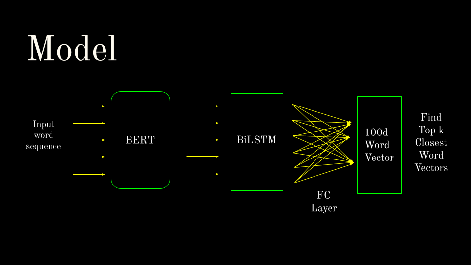
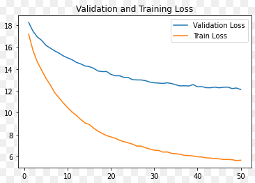

# Reverse Dictionary + High Quality Dataset
This repository contains the source code of the **Reverse Dictionary** built by my team as part of the CS 772 (NLP) course project at IIT Bombay.
Another major **contribution** is the introduction of a **novel high quality dataset** of 89930 high quality (word, definition) pairs using **vocabulary.com**.
While this work and its key ideas were motivated independently of [[1]](#1),  we did benefit greatly from the commentary and pointers contained therein, and share some similairities with them. We also use [[1]](#1) as the main point of comparison.
## **Note**
This repository uses `git lfs` to store model checkpoints and part of the dataset, due to which specific files have been replaced by pointers to the `git lfs` objects. Thus, after cloning, run
```
git lfs pull
```
to pull the actual data files.
## Project Structure
The work was done mainly using a Colab Notebook, and one of the final versions can be found in the `notebook/` directory. This repository is the conversion of the same into a "non-ipynb" form. Specifically,
- The `checkpoints/` directory contains the checkpoints of our model. We only upload the last checkpoint in the interest of space.
- The `data/` directory contains the GloVe vectors, and dictionaries used as training data.
- The `model/` directory contains the model itself, and helpers for training and computing evaluation metrics.
- The `utils/` directory contains functions to load data, clean it, convert predictions from the model to words, and so on.
- `config.py` contains the configuration used. Edit this file to change, for example, the number of epochs.
- `main.py` is the main script that takes user input and calls the various modules to do their job.
## Usage
Note: You may need to replace `python` by `python3` below, if the former uses python2 on your machine.

Run `pip -r requirements.txt` to install the necessary packages. Then, run `python main.py --train` to train the model, and `python main.py --eval` to run the evaluation. For the former, you may need to modify `config.py` to force a restart, and for the latter, first change the four numbers in `model/accuracy.txt` to `0`s, since the evaluation uses that file to checkpoint data, and will not restart unless the numbers indicate that examples are left.

To see the word for a definition, run `python main.py --defn <the definition>`, or `python main.py --file <file with defn>` if you prefer to feed it from a file. The `--top` flag can be used to ask for the top `k` words. An example run I obtained was
```
$ python3 main.py --def "A formal speech praising someone highly" --top 5
<- Some debug messaged by pytorch about how a GPU wasn't found on my laptop ->
1. encomium
2. paean
3. admonition
4. exhortations
5. benediction
```
## Task
The task in this work was to output a(the top-k) word(s) given its(their) definition.
## Dataset
Originally, we were using Project Gutenberg's unabridged Webster's dictionary and the EDMT dictionary as our corpus. Unfortunately, both of these dictionaries are of poor quality, due to three main reasons:
- They use semicolons to both delimit different meanings in a string, as well as punctuation within a meaning. Consequently, it turned out to be very hard to split apart the various meanings.
- In a large number of cases, the meaning itself appears as a word or a prefix of one in the definition - this led our initial attempts to always predict words *from* the definition as the meaning.
- A large number of examples of the sort of "Of X" meaning "X-ily" are present.

Thus, we resorted to a mixture of WordNet[[5]](#5) exracted meanings (61027) and **our novel dataset** (89930) . To develop our dataset, we utilized the words list in `/usr/dict/words` in unix. We filtered the words to only retain words appearing in GloVe. Then, we sent HTML requests to vocabulary.com [[6]](#6)
and parsed the HTML responses to create the dataset.

To load the latter, run
```
import pickle
dictionary = pickle.load(open('data/unix-dictionary.pkl', 'rb'))['dictionary']
```
Then, `dictionary` is a list of tuples of the form (word, definition).
We used a train-validation-loss split of 90-6-4.
## Model and Loss Function
 

We used a BERT model to encode given definitions. This was in turn passed to a BiLSTM network, whose outputs traversed a Fully Connected Layer before giving as output a 100-d word vector. We used the MSE Loss between the predicted word and the "ground truth" as our Loss. This choice was not arbitrary: often different words have very similar meanings, and must get partially rewarded when the other is the ground truth. Using word vectors as outputs simplifies this task, while trading off the size of the output vocabulary. The k-closest word vectors are taken as the model's top-k predictions.

We used `pytorch` and HuggingFace [[7]](#7) for all of the above.
## Training
We used Adam with an initial learning rate of `2e-5`, and betas set to the default `(0.9, 0.999)`. The learning rate was linearly dropped to 0 over the entired training duration of 50 epochs. Since the training was done on Google Colab (Pro), the training was paused and resumed a number of times. Hence, the hardware used was a combination of the NVIDIA Tesla T4 and the NVIDIA P100. Each epoch took anywhere from 45 to 70 minutes depending on the load at the other end. The graph of the training and validation loss are shown below.
 
## Results
We use top-1, top-10 and top-100 accuracy to evaluate our results, as in [[1]](#1). We use the values they publish as the baseline for comparison. We also compare against [[2]](#2), a recent publication from AAAI 2020 for comparison against a recent publication.
|               | Top-1 Accuracy | Top-10 Accuracy | Top-100 Accuracy | Validation Loss |
| ------------- | -------------- | --------------- | ---------------- | --------------- |
| Ours          | **48.706%**    | **58.953%**     | **65.618%**      | **12.118**      |
| Model from [[1]](#1)  | 7.9%   | 20.0%           | 37.0%            | 20.15           |
| Model from [[2]](#2)  | 9.0%   | 29.0%           | 58.0%            | -               |

## Discussion
The authors of [[1]](#1) reported that they observed the validation loss going up while training, even though the perceptual quality of the outputs increased. We too observed this originally, before switching to the novel dataset. In fact, it turns out that a number of non-words exist in the GloVe data, such as emails, brand names, or other words like "bulletinyy" which are not real words. With the original data our model often predicted such non-existent words, and we suspect that due to low number of examples, such words lie nearer to 0 and thus match the case when our model doesn't know what to do.

But once we switched to the better data, we saw a massive improvement in our training process and validation loss. It seems that the learning is greatly impacted by the quality of the dataset. In fact, the validation loss was still decreasing around epoch 50, and so it may be possible squeeze further accuracy out by training more.

If you found this repository useful, please consider citing. Thank you!

#### Note
Most of the experiments were run on colab, and the conversion to a GitHub repo-style format for the code was done post-facto. I did verify that the functions run on my laptop (wherein the GPU won't be recognized by pytorch), but due to the above fact, some errors may have crept in. If you find any, I would love to hear from you and fix them ASAP.

## References
<a id="1">[1]</a>  "Reverse Dictionary",  Noah Kuo, H. Billur Engin and Ethan Cheng, Stanford, 2020

<a id="2">[2]</a>  "Multi-channel Reverse Dictionary Model",  Zhang et. al., AAAI 2019

<a id="3">[3]</a>  "Project Gutenberg's Unabridged Dictionary", https://www.gutenberg.org/ebooks/661, accessed May 4, 2022.

<a id="4">[4]</a>   The EDMT dictionary, https://github.com/eddydn/DictionaryDatabase, accessed May 4, 2022.

<a id="5">[5]</a> Princeton University "About WordNet." WordNet. Princeton University. 2010.

<a id="6">[6]</a> www.vocabulary.com, Accessed May 4, 2022

<a id="7">[7]</a> www.huggingface.co, Acessed May 4, 2022
